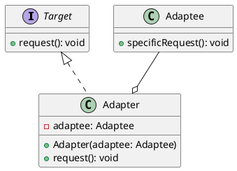
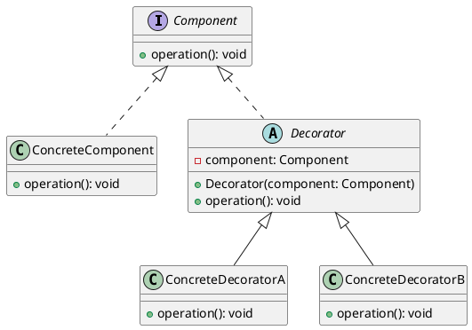

# 适配器模式
**目的** 将一个接口转换成客户希望的另一个接口，使得原本由于接口不兼容而不能一起工作的类可以协同工作

```puml
@startuml
interface Target {
    + request(): void
}

class Adaptee {
    + specificRequest(): void
}

class Adapter implements Target {
    - adaptee: Adaptee
    + Adapter(adaptee: Adaptee)
    + request(): void
}

Adaptee --o Adapter
@enduml

```

```puml
@startuml
interface Component {
    + operation(): void
}

class ConcreteComponent implements Component {
    + operation(): void
}

abstract class Decorator implements Component {
    - component: Component
    + Decorator(component: Component)
    + operation(): void
}

class ConcreteDecoratorA extends Decorator {
    + operation(): void
}

class ConcreteDecoratorB extends Decorator {
    + operation(): void
}


@enduml

```